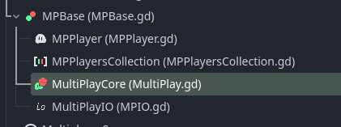
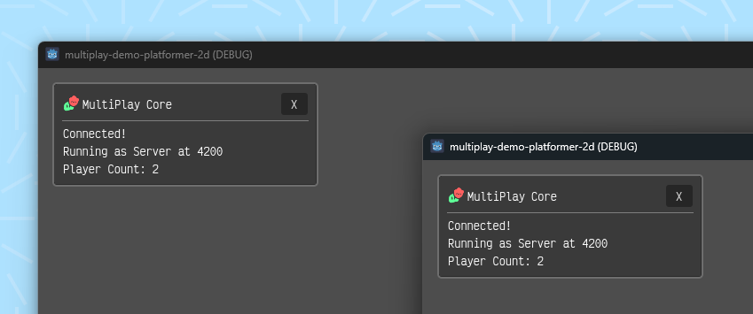

# Getting Started!

Let's get started with MultiPlay Core! In this tutorial, we'll be initializing an empty MultiPlay game. 

This tutorial assumes that you already created your Godot project.

## 1. Install MultiPlay Core

## 2. Enable MultiPlay Core Plugin

Go to Project Settings > Plugins > Enable MultiPlayCore

## 3. Restart your Godot Editor
The plugin will prompt you to restart to finish the setup.

## 3. Insert `MultiPlayCore` Node

Add `MultiPlayCore` Node to your root node.

## 4. Set Godot Editor to run multiple instances.
To test networking, go to Debug > Run Multiple Instances > Choose how many instances you like.

## 5. Run the project
Now with all that, you can run the project! After pressing run, the debug menu will appear on two windows. From there you can try different modes. For online play, press "Host + Act Client" on one window. Press "Connect" on another window, and there you have it!

That's it for an empty MultiPlay game! Now even though they're technically connected, the game still doesn't have anything in it yet. You can go and try our [demos](/docs/demo) to see how MultiPlay will work with your projects!
