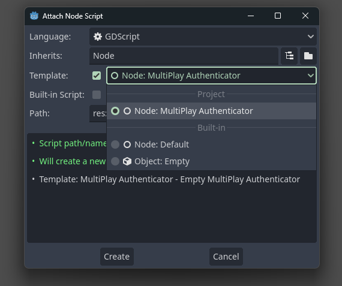

# Using the Authenticator


Authenticator lets the server check the player's credentials before letting them join in. Along with the purpose of uniquely identifying them.

## About Encryption..
Currently, there's no encryption yet. So sending raw passwords is HIGHLY not recommended. Instead, use a one-time temporary code to authenticate would be a better practice.

## Writing the authenticator

### 1. Write the Authenticator
You can easily create it using the script template "Multiplay Authenticator"



The script will be like in the following:

```gd
extends Node

@export var auth: MPAuth

func _ready():
	auth.authenticate_function = _auth_check

func _auth_check(plr_id: int, credentials_data: Dictionary, handshake_data: Dictionary):
	# Return authentication data, otherwise if failed, return false.
	return {}
```

You can write your own authentication logic in the `_auth_check` function. If authentication is a success, return with `dictionary`. Otherwise, return boolean `false`.

The user data you return can be accessed later using `mpp.auth_data`

### 2. Create MPAuth and assign it.
Second, Create `MPAuth` node as a child of `MultiPlayCore` like the following:


Then, assign MPAuth to your script, as the following:


And you're done! Go ahead and test it!