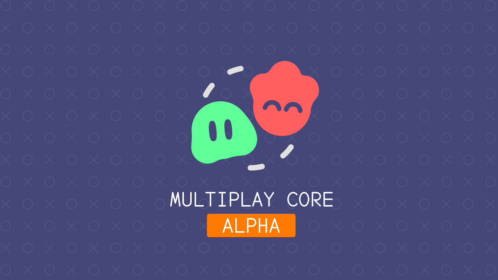
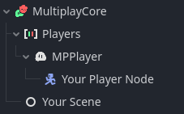

# Introduction to MultiPlay Core!


**Bugs Ahead!**  
MultiPlay Core is currently in its very early state. While you can try experimenting with it, it's not yet ready for production.



**Check Godot Versions!**  
MultiPlay Core is currently only tested in Godot v4.2^, and is __not__ compatible with Godot v3.x


Welcome to the documentation for MultiPlay Core! MultiPlay Core is a **Godot Multiplayer Framework**. Designed to make multiplayer easier, and meet user's preferences on multiplayer games! Some of the key features include:

- Multiple play mode with minimal code.
- Simplified API for general-purpose uses.
- Allow for user data when joining in. 

In this documentation/API. "MultiPlay Core" might be referred to as "MultiPlay", "MP" or "MPC" instead.

## Play Modes
MultiPlay comes with multiple multiplayer modes built-in. Including:
- Online
- One Screen
- Swap
- Solo

For more information, see [Play Modes](../mode-system) 

## Node Structure

MultiPlay will create the following structure when running:

- `MultiPlayCore` - Root of the multiplayer nodes.
- `Players` - Players collection, all players nodes will be in here.
- `MPPlayer` - The player node, the name is usually changed to Godot assigned peer ID. If you specify your player node, that node will be added as a child here. 
- `Your Scene` - Lastly, if you specify your starting scene. Or load it later via code. It'll be inserted as a child of `MultiPlayCore`

## Input System

When dealing with the input system. You can specify your own input actions in Godot's built-in Input map. However when using it in script. It had to pass MultiPlay's input system first.

MultiPlay's input system turns the input action into its input action. Each behaves differently according to the play mode. For more information, check the docs of each play mode to see how they behave.

For more information, see [Input System](../input-system) 
