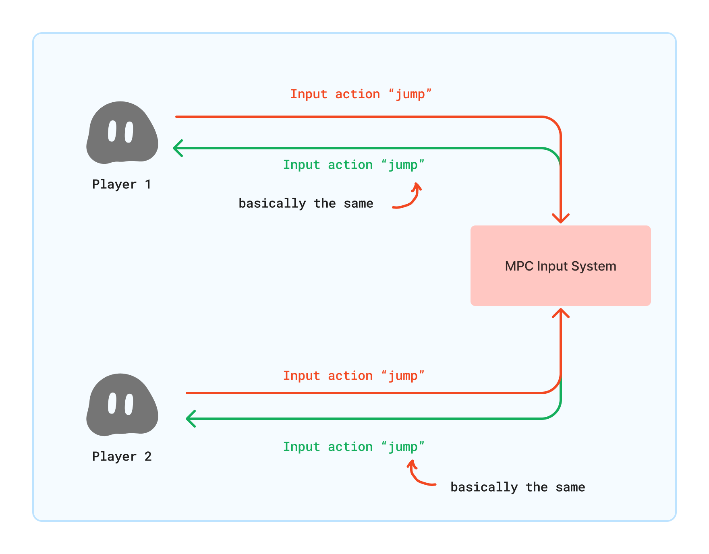

# Online Mode


This mode allows for networked multiplayer games. Players can connect to the server from different devices.

## Online mode URL
When connecting to online mode, it'll require a connection URL. Which syntax contains:

```
<HOSTNAME>:<PORT(Optional)>/<PATH(Optional)>
```

You don't have to specify the protocol. As the protocol is automatically assigned. 

## Roles in Online Mode

Roles of online mode include:

### Server
A server is an instance that clients connect to play the game. The server has full control of managing the state of the game, for example, such as Player position, Current map, etc.

### Client
A client is an instance that connects to the server. Think of the client as a player. They only have control of what they were assigned to by the server, for example, such as their own position, etc.

The server can also act as both Server and Client at the same time.

## Process of joining the server

Upon joining a server. The joining process begins as the following:


### Handshake & Credentials Data, What are these?

The client can send two types of data when joining, which include:

- **Handshake Data** - Public data about the player. This is exposed to everyone on the server.
- **Credentials Data** - Private data about the player, this is only used once and is not exposed to anyone on the server.


**About Authentication...**  
Authentication is optional. If there are no authenticators assigned, then credentials data is not really needed.


### Authority Assignment

When the new player node is created, the authority is automatically assigned to the player, recursively.

## Input Behaviour
In this mode, the input system will return the original input action name.



## Starting the online mode.

### As a server-only

```gd
mpc.start_online_host(false, handshake_data)
```

### As a server + client

```gd
mpc.start_online_host(true, handshake_data)
```

### Join a server

```gd
mpc.start_online_join(join_address, handshake_data, credentials_data)
```